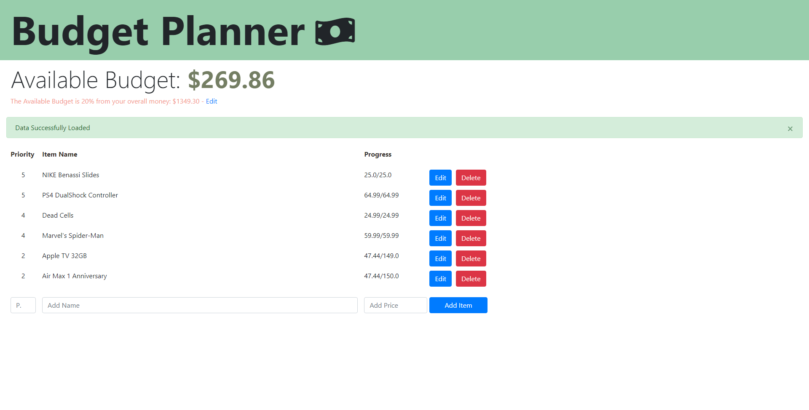

# Budget Planner

A program that takes a percentage amount of your total money as your “spending money” and allocate it to the items you want to use the money on.

## How It Works

The program allows it users to list items that they want to save up for. The program takes in the users’ total money (ie the total money you have in your bank account), which then takes a percentage of it as your spending money. As the default, 30% of your total would be used but this can changed based on your preference.

_Below is an example use of the program_

  

As you can see, my spending money is $$$ which is 30% of the total ($$$). The spending money will then be allocated to the items listed, prioritising the items with higher priority. As you can see, it completes the first 3 items which has priority #5 then goes down the list if there are leftover spending money.

### Add an item:

Users can simply add an item by inputting a valid priority number, from 0 to 9, (9 being the highest priority), a name, and the price of the item. If there’s no error, the program will notify the user that the item is successfully added to the list via the alert box and will be added on the item list.

[Insert Photo Here]

### Delete an item:

Item can be removed by pressing the item’s corresponding delete button. By performing the deletion process, the program will redo the allocation to reflect the new item list.

[Insert Photo Here]

### Edit an item:

User can press the Edit button to edit an item’s price, name, or priority. To do so, user must choose which attribute they want to edit and enter the correct value. If the inputted value is valid, it will be reflected in the program, reallocating the spending money if necessary.

[Insert Photo Here]

### Edit money information:

Similar to editing each items, users can also edit their total money and the percentage by pressing the edit button below the Spending Budget text. User will be prompt a modal where user can edit the information. Similar to above, if there are no error, the change will be reflected by the program.

[Insert Photo Here]

## Built With

- **Python**: Backend Language
- **HTML5, CSS3, JavaScript**: Frontend Language
- **Flask**: Python Web Framework
- **PySQL**: Python Framework
- **JQuery**: Javascript Framework
- **MySQL**: Database

## Licence

This project is licensed under the MIT License

## Bugs

For readability, I ensured that users can only see the first two decimal points. However, this result in some items having slightly more or less cents than it should have.

## Future Plans

The program should just be connected to the users’ back account so it will automatically update the total amount instead of manually doing it.
